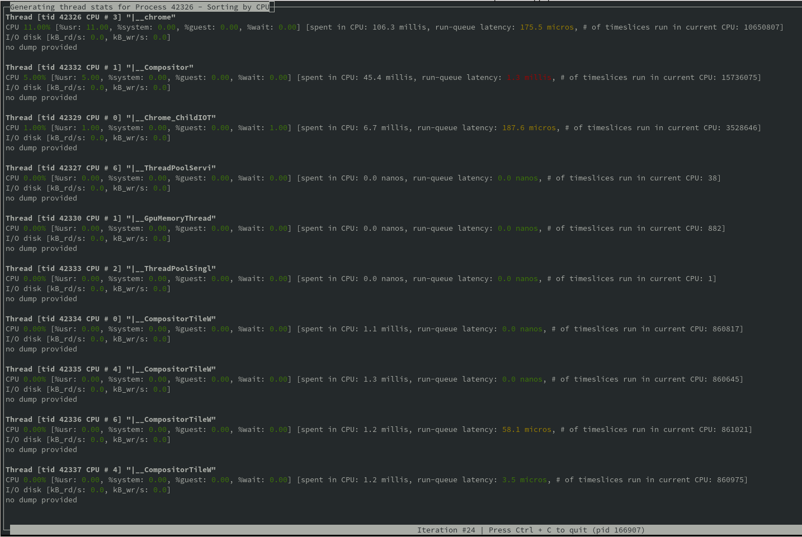
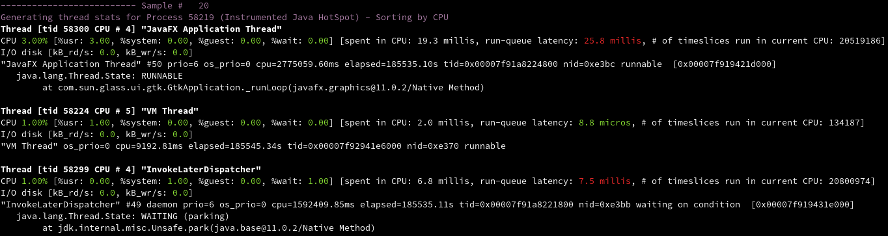

# Top Threads

A tiny command line tool that provides a dynamic real-time view of the active threads for a given process with stats of CPU, disk and scheduling.

The information comes from [pidstat] (provided by [systat]) and [/proc/{pid}/schedstat]. Also if the target process is a java process and the [jstack] Oracle tool is available it will try to use it to extract additional information such as thread name and stack trace.

The output can be viewed in full screen (similar to `top` or `watch`) or it can be printed on the terminal.

On each iteration, the following stats are displayed:

* CPU usage: _total_, _%usr_, _%system_, _%guest_ and _%wait_
* Disk usege: kB read per second and kB written per second
* Scheduler stats: time spent on the cpu, time spent waiting on a run queue (_runqueue latency_) and number of timeslices run on the current CPU.
* Java details: in case the target is a Java process that can be attached with `jstack`, some extra details is showed such as thread name and stack traces.

### Requirements

* `Python 3`
* [systat]

It's can be used only on `linux` platform.

### Quick start

```bash
wget -O top_threads.py 'https://github.com/cspinetta/top-threads/releases/download/0.0.1/top_threads.py' \
  && chmod +x top_threads.py
```

#### Examples:

```bash
# watch <pid>'s threads with default values
./top_threads.py -p <pid>

# print output in the terminal
./top_threads.py -p <pid> --display terminal

# sorting by run queue latency
./top_threads.py -p <pid> --sort rq

# in case a java process, change the number of stack traces to display
./top_threads.py -p <pid> --max-stack-depth 10

# enable debug log for troubleshooting
./top_threads.py -p <pid> --debug
```

**Notes:**
* The first output is with stats from the first execution of the process.
* `--display refresh` provides a view similar to `top` or `watch` (the default) while `terminal` prints the output on each iteration in the terminal like `pidstat`.

### Usage

```bash
usage: top_threads.py [-h] -p PID [-n [NUMBER]]
                      [--max-stack-depth [STACK_SIZE]]
                      [--sort [{cpu,rq,disk,disk-rd,disk-wr}]]
                      [--display [{terminal,refresh}]] [--no-jstack] [--debug]

Tool for analysing active Threads

optional arguments:
  -h, --help            show this help message and exit
  -p PID                Process ID
  -n [NUMBER]           Number of threads to show per sample. Default: 10
  --max-stack-depth [STACK_SIZE], -m [STACK_SIZE]
                        Max number of stack frames (only when jstack can be
                        used). Default: 1
  --sort [{cpu,rq,disk,disk-rd,disk-wr}], -s [{cpu,rq,disk,disk-rd,disk-wr}]
                        Field used for sorting. Default: cpu
  --display [{terminal,refresh}], -d [{terminal,refresh}]
                        Select the way to display the info: terminal or
                        refresh. Default: refresh
  --no-jstack           Turn off usage of jstack to retrieve thread info like
                        name and stack
  --debug               Turn on logs for debugging purposes

```

### Motivation

This tool comes from the need to want to see the time each thread spends in the runqueue waiting to be able to start running.
That is a really useful metric to understand if the process is being slow down because the CPU is saturated.
For this reason this tool emerged. It gets information from [pidstat], [/proc/{pid}/schedstat] and [jstack]:

* [pidstat] to get cpu and disk usage metrics from each thread in time interval.
* [/proc/{pid}/schedstat] to gets metrics from the runqueue. 
* [jstack] is used in case the process that is beaing monitored is an attachable java process, to obtain information such as thread name and stack traces.

### What is a good use case for this tool?

I often use this script when I have to analyze a performance problem at thread level and I want to inspect the dynamic usage of the cpu or the disk.

Some questions this tool help me to answer:

* Which thread is eating the entire CPU?
* How long are the threads waiting to take the CPU?
* What threads are using the disk right now?

The *run queue latency* is the metric I usually look at first because it's difficult to get from other traditional system tools and this script displays it at thread level.

The importance of this metric comes from the fact that the run queue latency is an excellent metric to identify CPU saturation.

In case you suspect you are being limited by a CPU saturation, you may look for a tool that help you to analyze the runqueue in more details. If you have root privileges you can try with BCC: [linux-bcc-runqlat](http://www.brendangregg.com/blog/2016-10-08/linux-bcc-runqlat.html)

### Example in pictures

* With `--display refresh` (the default):



* With `--display terminal`:



[/proc/{pid}/schedstat]: https://www.kernel.org/doc/html/latest/scheduler/sched-stats.html#proc-pid-schedstat
[systat]: https://github.com/sysstat/sysstat
[pidstat]: https://linux.die.net/man/1/pidstat
[jstack]: https://docs.oracle.com/javase/9/tools/jstack.htm#JSWOR748
